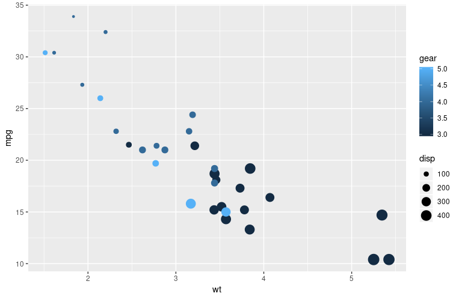

## Why do we visualize? 

* to get better understanding of the data. 
* to understand relationship between variables. 
* to help discovering insights. 

## How to visualize in R?

* basic R plot
* ggplot2

## What is ggplot2?
{width=80px} 

* [ggplot2](https://ggplot2.tidyverse.org/) is a library for declaratively creating graphics
* it is based on The Grammar of Graphics. 
  + Grammar of Graphics is a concept that defines a plot as a set of component layers: **aesthetic and geometry**. 
  + You **provide the data**, tell ggplot2 how to map variables to **aesthetics**, what graphical **geometries** to use, and it takes care of the details.

## Grammar of Graphic

A plot is basically a stack of layers consisting of:

>- data
>- aesthetic  --> aes()
>- geometry   --> geom_
>- theme      --> theme()

## Take a look at this plot

A scatter plot of `mtcars` data with x and y axes are mapped to `wt` and `mpg` columns, respectively. 



## Now, look at the graphic in a 'Grammar of Graphics' way. 

A plot is just a blank canvas

{width=60%}

## Now, look at the graphic in a 'Grammar of Graphics' way. 

A plot is just a blank canvas + aesthetic 

{width=60%}

## Now, look at the graphic in a 'Grammar of Graphics' way. 

A plot is just a blank canvas + aesthetic + geometry

{width=60%}

## Now, look at the graphic in a 'Grammar of Graphics' way. 

A plot is just a blank canvas + aesthetic + geometry + more aesthetics

{width=60%}

## Now, look at the graphic in a 'Grammar of Graphics' way. 

A plot is just a blank canvas + aesthetic + geometry + more aesthetics + labels

{width=60%}

## Translate the Grammar of Graphics to ggplot

A plot is just a blank canvas 

```{r eval=FALSE}
  ggplot(mtcars)
```

{width=60%}

## Translate the Grammar of Graphics to ggplot 

A plot is just a blank canvas + aesthetic

```{r eval=FALSE}
  ggplot(mtcars, aes(x = wt, y = mpg)) 
```

{width=60%}

## Translate the Grammar of Graphics to ggplot 

A plot is just a blank canvas + aesthetic + geometry
```{r eval=FALSE}
  ggplot(mtcars, aes(x = wt, y = mpg, size = disp, color = gear)) + 
  geom_point()
```

{width=60%}

## Translate the Grammar of Graphics to ggplot

A plot is just a blank canvas + aesthetic + geometry + more aesthetics

```{r eval=FALSE}
  ggplot(mtcars, aes(x = wt, y = mpg, size = disp, color = gear)) + 
  geom_point()
```

{width=60%}

## Translate the Grammar of Graphics to ggplot 

A plot is just a blank canvas + aesthetic + geometry + more aesthetics + labels

```{r eval=FALSE}
  ggplot(mtcars, aes(x = wt, y = mpg, size = disp, color = gear)) + 
  geom_point() +
  labs(title = "The miles/gallon spent based on the weight of the cars")
```

{width=60%}


## Drawing your first plot

### Preparation

* Make sure you have the library installed on your machine: 
  ```{r eval = FALSE}
    install.packages('ggplot2')
  ```
* load the ggplot library: 
   ```{r eval = FALSE}
    library(ggplot2)
  ```
* use the dataset [`mtcars`](https://stat.ethz.ch/R-manual/R-devel/library/datasets/html/mtcars.html), available in R Studio. 
  + explore its structure: 
  ```{r eval = FALSE} 
    str(mtcars)
  ```
***
Now replicate this script on your own machine.
```{r eval=FALSE}
  library(ggplot2)

  ggplot(mtcars, aes(x = wt, y = mpg, size = disp, color = gear)) + 
    geom_point() +
    geom_smooth()
    labs(title = "The miles/gallon spent based on the weight of the cars")

```

Notice that we add layers using the symbol `+`. 

***

Your output should look like this:

{width=80%}

---


## Playing with geoms {.columns-2 .smaller}
Spend your time playing with different types of geoms by just simply changing the geom from the example that we have created earlier. 

### geom_bar 
```{r eval=FALSE}
library(ggplot2)
ggplot(mtcars, aes(x = factor(cyl), 
                   fill = factor(am))) +
  # try position = 'dodge', 'fill'
  geom_bar(position = 'stack') +  
  scale_x_discrete('Cylinders') +
  scale_y_continuous('Number') +
  scale_fill_manual('Transmission', 
    values = c("#E41A1C", "#377EB8"),
    labels = c("Manual", "Automatic")) 
```

<p class="forceBreak"></p>

```{r echo=FALSE, message=FALSE, fig.width=4.7}
    library(ggplot2)
    ggplot(mtcars, aes(x = factor(cyl), fill = factor(am))) +
      geom_bar(position = 'stack') +  # try position = 'dodge', 'fill'
      scale_x_discrete('Cylinders') +
      scale_y_continuous('Number') +
      scale_fill_manual('Transmission', 
                        values = c("#E41A1C", "#377EB8"),
                        labels = c("Manual", "Automatic")) 
```

***

### histogram

#### 1 - Make a univariate histogram
```{r eval=FALSE}
ggplot(mtcars, aes(x = mpg)) +
  geom_histogram()
```

#### 2 - Plot 1, plus set binwidth to 1 in the geom layer
```{r eval=FALSE}
ggplot(mtcars, aes(x = mpg)) +
  geom_histogram(binwidth = 1)
```

#### 3 - Plot 2, plus MAP ..density.. to the y aesthetic (i.e. in a second aes() function)
```{r eval=FALSE}
ggplot(mtcars, aes(x = mpg)) +
  geom_histogram(binwidth = 1, aes(y = ..density..))
```

#### 4 - plot 3, plus SET the fill attribute to "#377EB8"
```{r eval=FALSE}
ggplot(mtcars, aes(x = mpg)) +
  geom_histogram(binwidth = 1, fill = "#377EB8", aes(y = ..density..))
```

## Playing with aesthetics

#### Basic scatter plot: wt on x-axis and mpg on y-axis; map cyl to col
```{r eval=FALSE}
ggplot(mtcars, aes(x=wt, y=mpg, color=cyl)) + geom_point(size=4)
```

#### Hollow circles 
```{r eval=FALSE}
ggplot(mtcars, aes(x=wt, y=mpg, color=cyl)) + geom_point(size=4, shape=1)
```

#### Add transparency 
```{r eval=FALSE}
ggplot(mtcars, aes(x=wt, y=mpg, color=cyl)) + geom_point(size=4, shape=1, alpha=0.6)
```

## Playing with facet 

* Facet = splitting a plot into several subplots. 
* Let's play using the [`iris`](https://rpubs.com/moeransm/intro-iris) dataset. 
* Let's take a brief look into the dataset

```{r}
  str(iris)
  names(iris)
```

## Playing with facet {.columns-2 .smaller}
Now, let's start playing

```{r eval=FALSE}
ggplot(iris, aes(x=Sepal.Length, y=Sepal.Width))+
  geom_point() +
  facet_grid(. ~ Species)
```

<p class="forceBreak"></p>

```{r echo=FALSE, message=FALSE, fig.width=4.7}
    library(ggplot2)
    ggplot(iris, aes(x = Sepal.Length, y = Sepal.Width)) +
      geom_point() +
      facet_grid(. ~ Species)
```

## Playing with facet {.columns-2 .smaller}

use `geom_jitter()` instead of `geom_point()`

```{r eval=FALSE}
library(ggplot2)

ggplot(iris, aes(x=Sepal.Length, y=Sepal.Width))+
  geom_point() +
  facet_grid(. ~ Species)
```
<p class="forceBreak"></p>

```{r echo=FALSE, message=FALSE, fig.width=4.7}
    library(ggplot2)
    ggplot(iris, aes(x = Sepal.Length, y = Sepal.Width)) +
      geom_jitter() +
      facet_grid(. ~ Species)
```

## Playing with facet {.columns-2 .smaller}

Now, let's level up the game a bit.
Modify the `iris` dataset to get a more interesting visualization. 

```{r eval=FALSE, tidy=TRUE}
library(tidyr)

iris %>%
  gather(key, value, -Species) %>%
  separate(key, c("Part","Measure"), sep="\\.") %>%
  ggplot(aes(x = Species, y = value, col = Part)) +
  geom_jitter() +
  facet_grid(. ~ Measure)
```
<p class="forceBreak"></p>

```{r echo=FALSE, message=FALSE, fig.width=4.7}
library(tidyr)

iris %>%
  gather(key, value, -Species) %>%
  separate(key, c("Part", "Measure"), sep = "\\.") %>%
  ggplot(aes(x = Species, y = value, col = Part)) +
  geom_jitter() +
  facet_grid(. ~ Measure)
```

## Playing with facet {.columns-2 .smaller}

Give it another try!

```{r eval=FALSE, tidy=TRUE}
library(tidyr)
library(dplyr)
library(ggplot2)

iris %>%
  mutate(Flower = 1:nrow(iris)) %>%
  gather(key, value, -Species, -Flower) %>%
  separate(key,c("Part", "Measure"),sep="\\.")%>%
  spread(Measure, value) %>%
  ggplot(aes(x=Length, y=Width, color=Part)) +
  geom_jitter() +
  facet_grid(. ~ Species)
```
<p class="forceBreak"></p>

```{r echo=FALSE, message=FALSE, fig.width=4.7}
library(tidyr)
library(dplyr)
library(ggplot2)

iris %>%
  mutate(Flower = 1:nrow(iris)) %>%
  gather(key, value, -Species, -Flower) %>%
  separate(key, c("Part", "Measure"),sep="\\.")%>%
  spread(Measure, value) %>%
  ggplot(aes(x = Length, y = Width, color = Part)) +
  geom_jitter() +
  facet_grid(. ~ Species)
```

## Questions?


